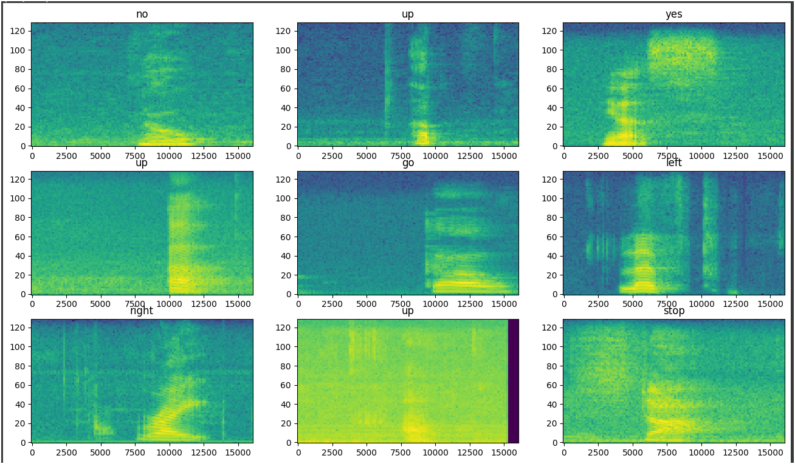
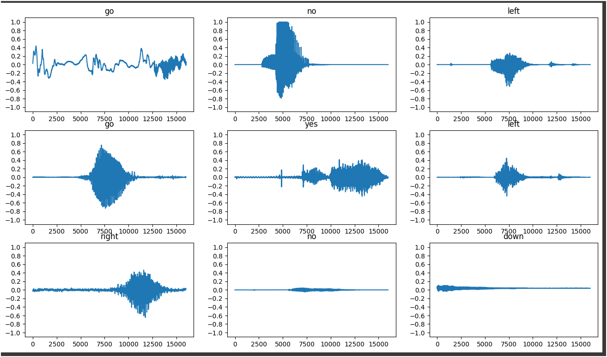
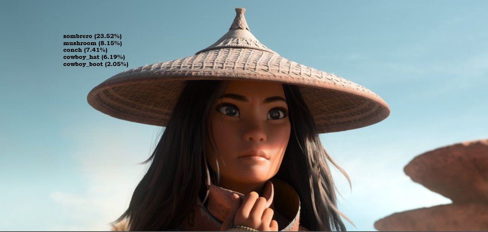
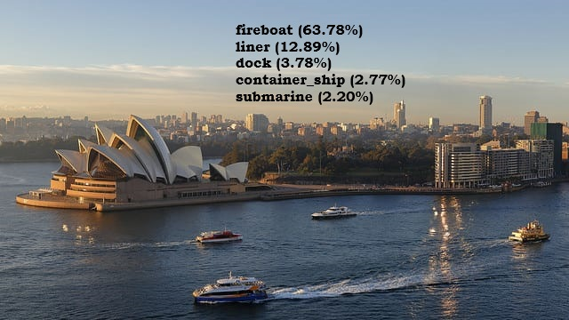
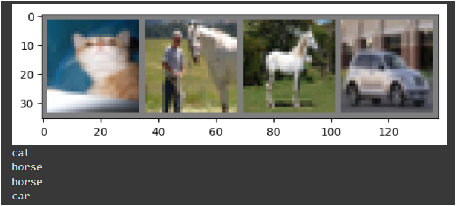
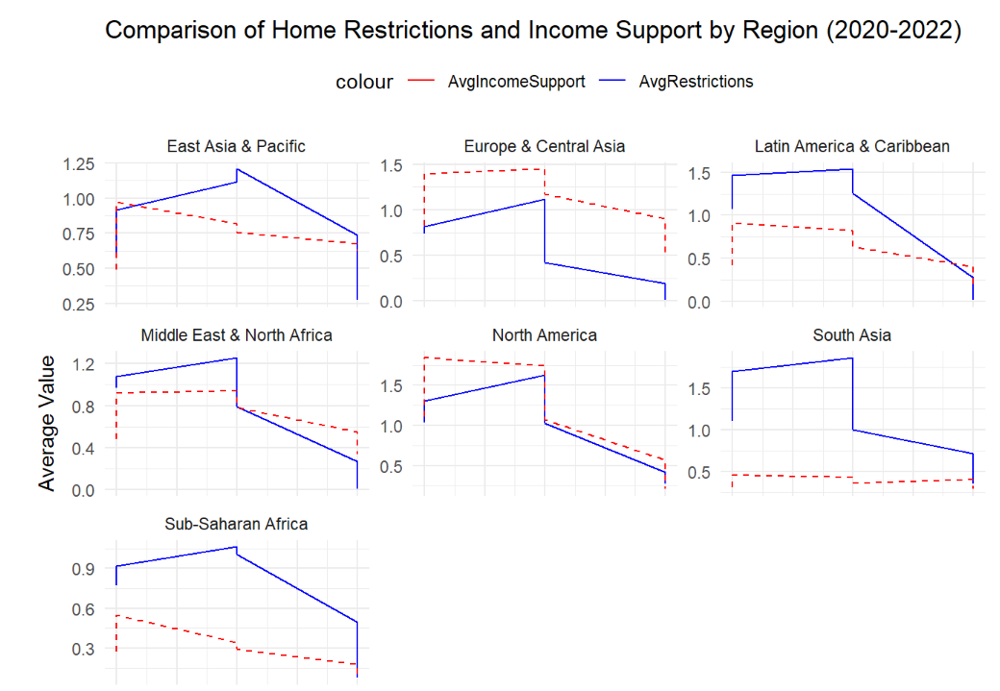
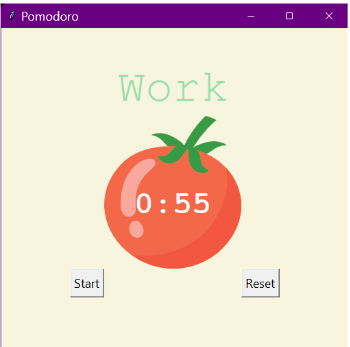
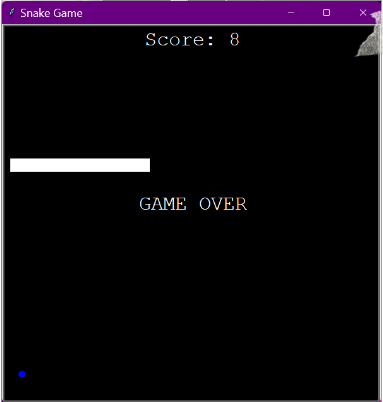
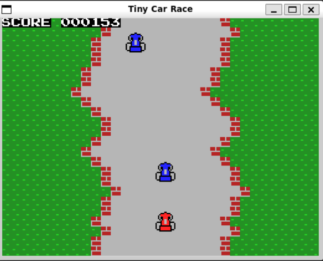

## Selected projects in data science, machine learning and computer vision

### Speech to text recognition 

This is the current project I am working on. 

  

---

### Interactive Image Classification Tool using VGG16

For each image uploaded, Top 5 labels for the images are displayed with their probabilities. In this project, I used VGG16 for classification which is trained on ImageNet dataset.

    

  

[View code on Colab](https://colab.research.google.com/drive/1c1vrtcP-dPXyx8yLOV-eZ-41zp8xFooc?usp=sharing)

---

### Image Classification using PyTorch on CIFAR-10 datset

Explanation 

   

[View code on Colab](https://colab.research.google.com/drive/19RLDS4zTxGW7AOs_URwUd7XhOTd_guvO?usp=sharing)

---

### NLP: Sentiment Analysis on India's Foreign Affairs Minister's first Book 

I webscraped the reviews from the Amazon, cleaned them using regex specifications, tokenized the text and generated a wordcloud. Finally plotted the sentiments using matplotlib. Used Beautifulsoup for webscraping. lemmatization, tokenization.

 

[View code on Colab](https://colab.research.google.com/drive/13BdIshN7T6oLoTnMHFib8pYzlMyFkVFp?usp=sharing)

---

### COVID data visualization

Explanation 

  

[View code on Colab]

---
### Classic Algorithms 

Hierarchical Clustering  [View code on Colab](https://colab.research.google.com/drive/1_MYj3caH_BZQ7Ja-fRK4eYNItR_GkAxB?usp=sharing)

K-Means Clustering 

--- 

### Skills-based projects 
A selection of smaller projects demonstrating specific data science and Python skills 
- [As Head of Education, Data Science Society conduct fun workshops on Python](https://pythonworkshop.my.canva.site/)
- [Python Automation in emails for LSE 180 Degrees Consulting Society using smtplib](#)
- [Built Automated games using Selenium in Python](#)
- [Completed a 100 days Python challenge with daily coding](#)

          

