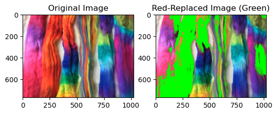
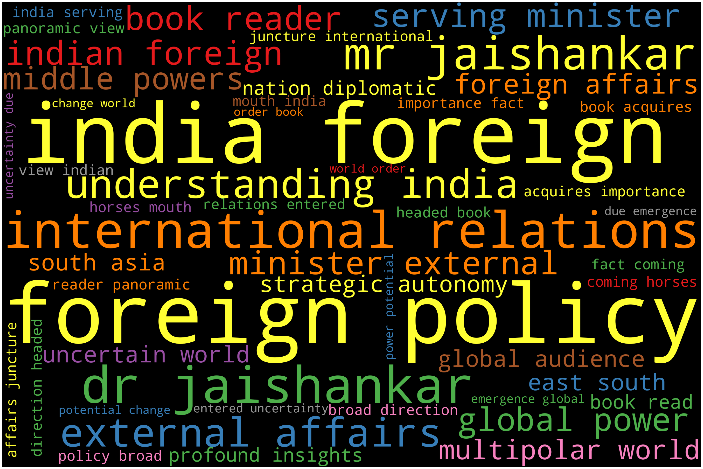

## How I used Data in real-life

### ColorVision Assist: Enhancing Visual Accessibility for Red-Blindnes

In this project, I noticed that my friend struggled to see red colors due to red-blindness (protanopia). So, I decided to use computer vision to help him. I created a prototype that changes images to colors he can see better by using cv2 library.

---
### Simplified Charity Outreach Pipeline: Helped LSE 180 Degrees Consulting Society

Wrote a Python script that automates the outreach process to charities. Using smtplib, the society was able to send personalized emails with email attachments to 100+ charities with one click. The script extracted data from an Excel file, used Gmail for sending emails, and finally stored the data for sent emails in a CSV file. 

---

## Selected projects in data science, machine learning and computer vision

### Voice Commands Decoded: Building an Intelligent Speech-to-Text Model

Developing a TensorFlow-based audio classification model using the mini Speech Commands dataset. In this, I'm training a convolutional neural network (CNN) model for classifying spoken commands, and then evaluate the model's performance.

  

---

###  Know what's in your image

For each image uploaded, Top 5 labels for the images are displayed with their probabilities. In this project, I used VGG16 for classification which is trained on ImageNet dataset.

    

  

[View code on Colab](https://colab.research.google.com/drive/1c1vrtcP-dPXyx8yLOV-eZ-41zp8xFooc?usp=sharing)

---

### Deep Learning for Image Classification

Implemented an image classification project using PyTorch on the CIFAR-10 dataset. Defined a convolutional neural network (CNN), specified the loss function and optimizer, and trained the model on the training set.

   

[View code on Colab](https://colab.research.google.com/drive/19RLDS4zTxGW7AOs_URwUd7XhOTd_guvO?usp=sharing)

---

### Unveiling Foreign Minister's Book Vibes

I web scraped Amazon reviews, applied regex for data cleaning, and used Beautiful Soup for extracting information. Implemented lemmatization and tokenization techniques to process the text data, followed by generating a word cloud for visualization. Analyzed the plotted sentiment analysis based on the processed reviews.

 

[View code on Colab](https://colab.research.google.com/drive/13BdIshN7T6oLoTnMHFib8pYzlMyFkVFp?usp=sharing)

---

### Visualizing Global COVID-19 Policy Responses in R

I analyzed Covid-19 policy responses using the OxCGRT study's data, visualizing the global implementation of stay-at-home recommendations from 2020 to 2022 with ggplot2. The data underwent processing to simplify scales for stay-at-home directives and income support. The resulting visualization offers insights into the extent of these measures across regions, enabling a comparative analysis of restrictions and income support implementation during the specified period.

 

---

### Made Creative Projects with popular APIs

🎵 Used Spotify's Web API and Python's Beautiful Soup library to create playlist for my birth date. The script scraped the Billboard chart for my birthdate, searched for the songs on Spotify, and created a private playlist with the top 100 songs from that date. 

☔ Used OpenWeather API and Twilio API for weather forecast updates. This Python script checked the weather forecast for a specific location and sent a text message alert using the Twilio API if it's going to rain within the next 12 hours.

🗠 Used Alpha Vantage API and Twilio API for stock companies news updates. This Python script retrieved the daily stock price data for a specific company and sends news articles related to the company if there is a significant change in the stock price.

[View code on GitHub](https://github.com/RiyaChhikara/Projects_with_API/tree/main)

## Other Data Based Tasks
- [As the Head of Education, LSE Data Science Society conduct fun workshops on Python, AI and ML](https://pythonworkshop.my.canva.site/)
- [Built Automated games using Selenium in Python](#)
- [Completed a 100 days Python challenge with daily coding](#)

          

