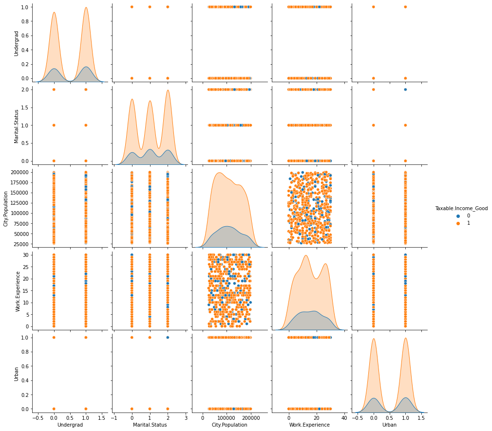

## Selected projects in data science, machine learning and computer vision

### Speech to text recognition 

Developing a TensorFlow-based audio classification model using the mini Speech Commands dataset. In this, I'm training a convolutional neural network (CNN) model for classifying spoken commands, and then evaluate the model's performance.

  

---

### Interactive Image Classification Tool using VGG16

For each image uploaded, Top 5 labels for the images are displayed with their probabilities. In this project, I used VGG16 for classification which is trained on ImageNet dataset.

    

  

[View code on Colab](https://colab.research.google.com/drive/1c1vrtcP-dPXyx8yLOV-eZ-41zp8xFooc?usp=sharing)

---

### Know what's in your image

Implemented an image classification project using PyTorch on the CIFAR-10 dataset. Defined a convolutional neural network (CNN), specified the loss function and optimizer, and trained the model on the training set.

   

[View code on Colab](https://colab.research.google.com/drive/19RLDS4zTxGW7AOs_URwUd7XhOTd_guvO?usp=sharing)

---

### NLP: Sentiment Analysis on India's Foreign Affairs Minister's first Book 

I web scraped Amazon reviews, applied regex for data cleaning, and used Beautiful Soup for extracting information. Implemented lemmatization and tokenization techniques to process the text data, followed by generating a word cloud for visualization. Analyzed the plotted sentiment analysis based on the processed reviews.

 

[View code on Colab](https://colab.research.google.com/drive/13BdIshN7T6oLoTnMHFib8pYzlMyFkVFp?usp=sharing)

---

### COVID data visualization

I analyzed Covid-19 policy responses using the OxCGRT study's data, visualizing the global implementation of stay-at-home recommendations from 2020 to 2022 with ggplot2. The data underwent processing to simplify scales for stay-at-home directives and income support. The resulting visualization offers insights into the extent of these measures across regions, enabling a comparative analysis of restrictions and income support implementation during the specified period.

  

[View code on Colab]

---
### Classic Algorithms 

Hierarchical Clustering  [View code on Colab](https://colab.research.google.com/drive/1_MYj3caH_BZQ7Ja-fRK4eYNItR_GkAxB?usp=sharing)

K-Means Clustering 

--- 

### Skills-based projects 
A selection of smaller projects demonstrating specific data science and Python skills 
- [As Head of Education, Data Science Society conduct fun workshops on Python](https://pythonworkshop.my.canva.site/)
- [Python Automation in emails for LSE 180 Degrees Consulting Society using smtplib](#)
- [Built Automated games using Selenium in Python](#)
- [Completed a 100 days Python challenge with daily coding](#)

          

